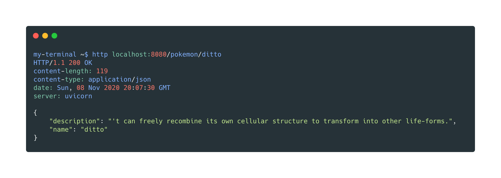

###### REST API that given a Pokemon name return its Shakespearean description

#### 📝 NOTE
The app use externals api services:
- [pokeapi](https://pokeapi.co/)
- [shakespeare translator](https://funtranslations.com/api/shakespeare)

While the **pokeapi** service is free, the **Shakespeare translator** service is not.  
So the project use the free plan that is limited to **60 API calls** a day with distribution of **5 calls an hour** 

#### 💬 Description
I organized the project task with GitHub issues. You can check the project board [here](https://github.com/softwarebloat/PokeSpeare/projects/1)  
A CI is set up with [GitHub actions](https://github.com/softwarebloat/PokeSpeare/actions?query=workflow%3Aacceptance) that checks for:
- commit message pattern
- linting
- tests

> NOTE: The CI runs only unit-tests because of the limitation of the free plan of the shakespeare translator service

### 🚀 Docker 
You can run the application in a docker container  

##### Requirements
- [install docker](https://docs.docker.com/get-docker/)

To **build** the app, you can run the following command:  
`make docker-build`

After you built it, you can run it:  
`make docker-run`  
The app is now up and running at `localhost:8080` and you can access the swagger at `localhost:8080/docs`  

After closing the app, you can run `make docker-rm` to remove the container

### 💻 API Usage
When the app is up, you can ask for a Shakespearean translation of a pokemon description  
Using [httpie](https://httpie.org/) for example or any other http client  
The following **GET** endpoint is exposed: `/pokemon/<pokemon-name>`

### 🔨 Development
You can also run locally the app, tests, linter, etc...  
This facilitate the local development process

##### Requirements
- [poetry](https://python-poetry.org/) python dependency manager
- python 3.8+

List of possible commands:
- `make install-dependencies` to create the virtual env and install al the project dependencies
- `make lint` to run the linter
- `make unit-tests:` to run all the unit tests of the project with coverage report
- `make tests` to run all the tests (integration included)
- `make dev` to run the application locally with auto reload reachable at `localhost:8080` or `localhost:8080/docs` for the swagger